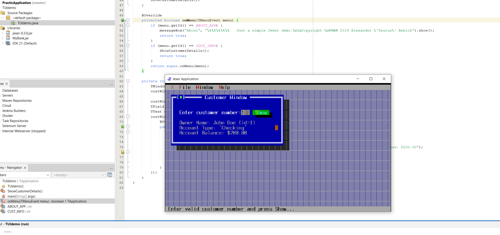
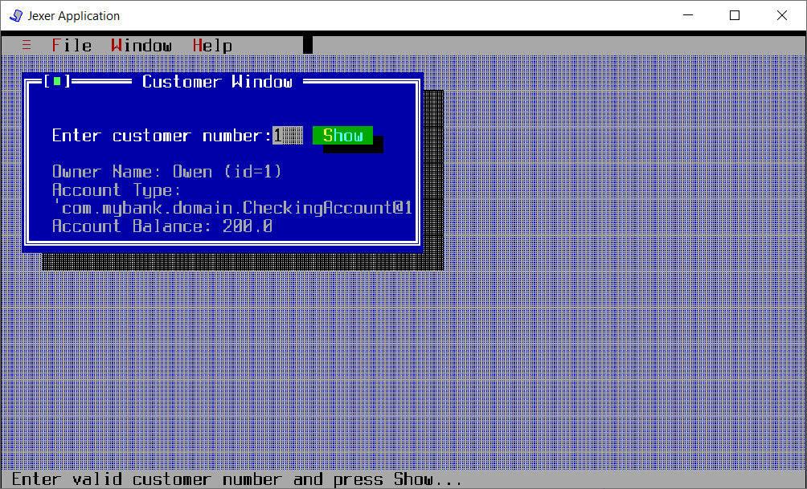

[](https://classroom.github.com/open-in-codespaces?assignment_repo_id=15189529)
# UI Lab 1


## Змінений клас ShowCustomerDetails

```java
private void ShowCustomerDetails() {
        
        try (BufferedReader br = new BufferedReader(new FileReader("test.dat"))) {
            int numberOfCustomers = Integer.parseInt(br.readLine());
            for (int i = 0; i < numberOfCustomers; i++) {
                br.readLine();
                String[] customerInfo = br.readLine().split("\t");

                Bank.addCustomer(customerInfo[0], customerInfo[1]);
                
                int numberOfAccounts = Integer.parseInt(customerInfo[2]);
                
                Customer customer = Bank.getCustomer(i);

                for (int j = 0; j < numberOfAccounts; j++) {
                    String[] accountInfo = br.readLine().split("\t");
                    String accountType = accountInfo[0];
                    double balance = Double.parseDouble(accountInfo[1]);
                    switch (accountType) {
                        case "S":
                            double interestRate = Double.parseDouble(accountInfo[2]);
                            customer.addAccount(new SavingsAccount(balance, interestRate));
                            break;
                        case "C":
                            double overdraftAmount = Double.parseDouble(accountInfo[2]);
                            customer.addAccount(new CheckingAccount(balance, overdraftAmount));
                            break;
                    }
                }
            }
        } catch (IOException e) {
            e.printStackTrace();
        }
        
        
        
        TWindow custWin = addWindow("Customer Window", 2, 1, 40, 10, TWindow.NOZOOMBOX);
        custWin.newStatusBar("Enter valid customer number and press Show...");

        custWin.addLabel("Enter customer number: ", 2, 2);
        TField custNo = custWin.addField(24, 2, 3, false);
        TText details = custWin.addText("Owner Name: \nAccount Type: \nAccount Balance: ", 2, 4, 38, 8);
        custWin.addButton("&Show", 28, 2, new TAction() {
            @Override
            public void DO() {
                try {
                    int custNum = Integer.parseInt(custNo.getText());
                    Customer customer = Bank.getCustomer(custNum);
                    Account account = customer.getAccount(0);
                    //details about customer with index==custNum
                    details.setText("Owner Name: "+customer.getFirstName()+" (id="+custNum+")\nAccount Type: '"+account+"'\nAccount Balance: "+account.getBalance());
                } catch (Exception e) {
                    messageBox("Error", "You must provide a valid customer number!").show();
                }
            }
        });
    }
```



## Приклад читання з файлу




Я не розібралася як нормально можна вивести тип акаунта, тому виводиться як виводиться...

---
**УВАГА! Не забуваємо здавати завдання через Google Classroom та вказувати посилання на створений для вас репозиторій!**

Також пам'ятайте, що ніхто не заважає вам редагувати файл README у вашому репозиторії😉.
А ще - дуже раджу спробувати нову фічу - інтеграцію з IDE REPL.it (хоч з таким завданням вона може й не впоратись, однак, цікаво ж!).


 
